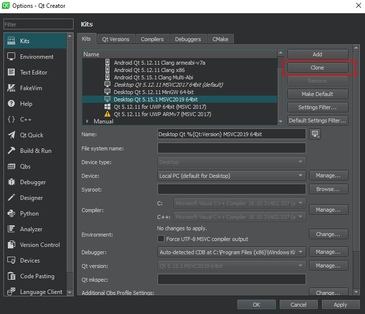
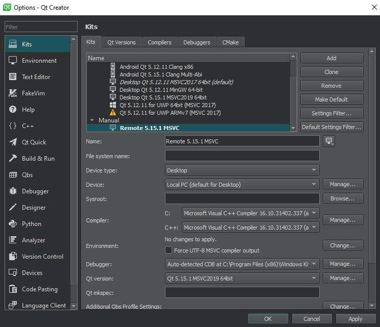
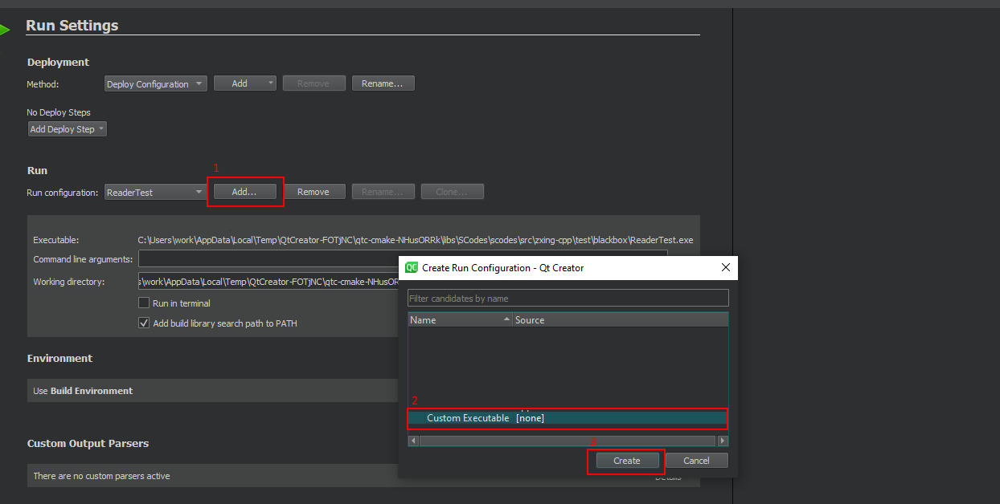
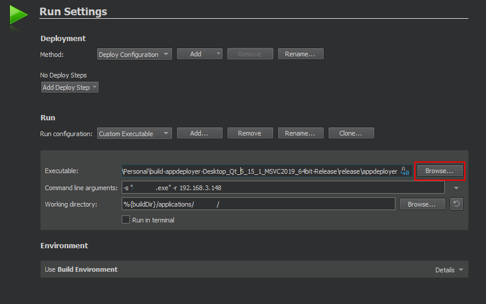

# AppDeployer

AppDeployer is an application, that allows to deploy Qt apps on remote PC.

## How it works?

1) Your app is built. After successful build process, you connect to host app.
2) App checks, if there's an instance of the copied app - if so, AppDeployer kills it.
3) Executable of the built app is sent to host.
4) AppDeployer runs freshly copied executable.
5) AppDeployer reads running app's logs, from "*/logs/latest.log*" file, and sends them to the client
6) If app quits - server disconnects from the client
7) If the client disconnects - the app is stopped.

## Requirements
AppDeployer assumes, that your app:

1) Is targeted to **Windows**
1) Is being built based on the "Release" kit
2) Generates log file in real-time to "*{parentDirOfExe}/logs/latest.log*"
3) Single line of log follows below format: 
```
[LOG_TYPE] ( qrc:filePath:method:line) - Sample log message!
```
or, if you don't need to print file URLs:
```
[LOG_TYPE] ( ::-1) - Sample log message!
```


## Installation using Qt Creator

1) Clone, and build AppDeployer using the "Release" kit of Qt version, that is >= 5.15. You also need to run *windeployqt* on the built executable, to make it work.
2) While in your app's project, in Qt Creator go to *Options* > *Kits*

3) Clone your kit, and name it, so you can remember it.

4) Go to *Projects* > *newly-created-kit* > *Run*, click *Add...*, and select *Custom Executable*, and then *OK*.

5) Setup executable: point it to the built AppDeployer executable. Set command-line arguments, where *-s* describes your app's executable name, *-r* remote host IP address. If the remote has a custom port set, you can also put it here by the *-p* parameter. **Note:** *Working directory* must be set to application's executable parent dir - if your exe is placed somewhere else, than build directory, you need to specify it, like on the screenshot below:


## Notes

AppDeployer is by default running in server mode using the 8129 port. The server is minimized to the system tray, from where you can exit it at any time. If you want to change the port, you can pass the *-p* parameter using command-line, or batch file.

AppDeployer should be built using at least Qt 5.15 version.

## Contributing
Pull requests are welcome. For major changes, please open an issue first to discuss what you would like to change.

